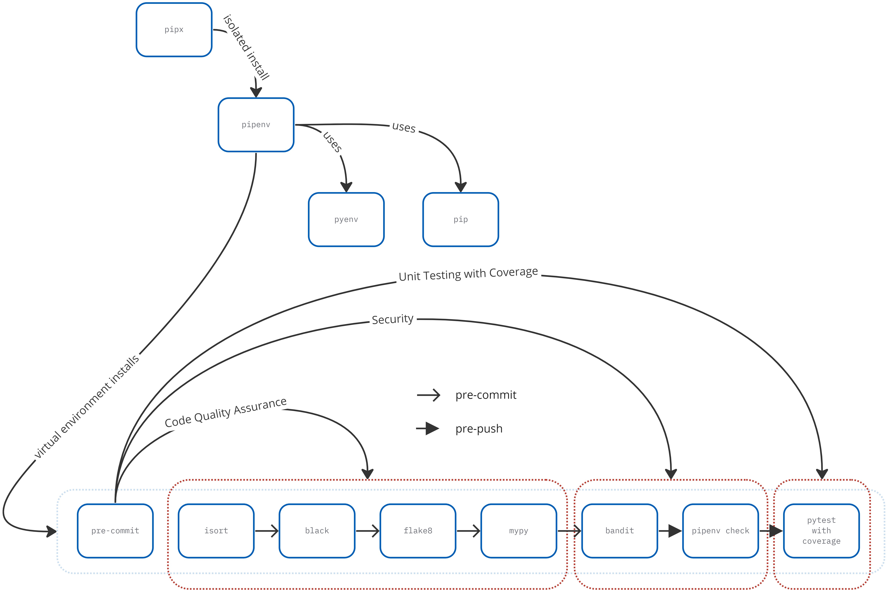

# Quality Assurance

This document explains the steps required to install and configure all the
required elements of the quality assurance in place for any Python project.
Moreover, includes the configuration details for the `pyproject.toml` and
`.pre-commit-config.yaml` files regarding quality, security, and testing.


<figcaption><code>pipenv</code> and <code>pre-commit</code> flow diagram.</figcaption>

**NOTICE:** Using UNIX shell commands in a Debian GNU/Linux Bash shell.
Adapt accordingly your Operating System.

## Step by Step

**NOTICE:** Make sure you've completed the
[Prerequisites](../README.md#prerequisites) for your operating system case!

### Clean and Tidy

#### `/.gitignore`

Avoid committing and pushing generated, private, local files. More exclusions
may be added at your discretion.

```shell
/**/__pycache__/
/.idea/
/build/
/dist/
/*.egg-info/
```

### Code Formatting

`isort`, `black`

```shell
pipenv install isort black --dev
```

**NOTICE:** black and isort may have conflicts, since they both enforce styles
in the code (https://pycqa.github.io/isort/docs/configuration/black_compatibility.html).
To ensure isort follows the same style as black, add a line in the
configuration file as showed below:

`pyproject.toml`

```toml
[tool.isort]
profile = "black"
```

```shell
pipenv run isort .
pipenv run black .
```

### Code Style Enforcement

`flake8` + `pyproject.toml` support = `flake8p`

```shell
pipenv install Flake8-pyproject --dev
```

`pyproject.toml`

```toml
[tool.flake8]
max-line-length = 120
ignore = ["E203", "E266", "E501", "W503"]
max-complexity = 18
select = ["B", "C", "E", "F", "W", "T4"]
```

```shell
pipenv run flake8p .
```

### Type Checking

`mypy`

```shell
pipenv install mypy --dev
```

`pyproject.toml`

```toml
[tool.mypy]
files = "."
ignore_missing_imports = true
```

```shell
pipenv run mypy .
```

### Security

`bandit`, `pipenv check`

```shell
pipenv install bandit[toml] --dev
```

`pyproject.toml`

```toml
[tool.bandit]
assert_used.skips = "*/tests/*"
```

```shell
pipenv run bandit -c pyproject.toml -r .
pipenv check
```

### Testing

`pytest`, `pytest-cov`

```shell
pipenv install pytest pytest-cov --dev
```

`pyproject.toml`

```toml
[tool.pytest.ini_options]
addopts = "--cov --cov-fail-under=100"

[tool.coverage.run]
source = ["."]

[tool.coverage.report]
show_missing = true
omit = ["*/tests/*"]
exclude_lines = [
    "pragma: no cover",
    "def __repr__",
    "raise AssertionError",
    "raise NotImplementedError",
    "if __name__ == .__main__.:"
]
```

```shell
pipenv run pytest
```

### Git Hooks

`pre-commit`

Putting it all together, i.e., automating while distinguishing Git `commit`
fast-checking requirement from the Git `push` more time-consuming possible
actions such as `pytest` (including coverage) and `pipenv check`.

```shell
pipenv install pre-commit --dev
```

`.pre-commit-config.yaml`

**NOTICE:** The `pipenv check` and the `pytest` (including coverage) are
configured to run only on Git `push`!

```yaml
repos:
  - repo: local
    hooks:

      ### CODE FORMATTING

      - id: isort
        name: isort
        stages: [ commit ]
        language: system
        entry: pipenv run isort .
        types: [ python ]

      - id: black
        name: black
        stages: [ commit ]
        language: system
        entry: pipenv run black .
        types: [ python ]

      ### CODE STYLE ENFORCEMENT

      - id: flake8
        name: flake8
        stages: [ commit ]
        language: system
        entry: pipenv run flake8p .
        types: [ python ]

      ### TYPE CHECKING

      - id: mypy
        name: mypy
        stages: [ commit ]
        language: system
        entry: pipenv run mypy .
        types: [ python ]
        pass_filenames: false

      ### SECURITY

      - id: bandit
        name: bandit
        stages: [ commit ]
        language: system
        entry: pipenv run bandit -c pyproject.toml -r .
        types: [ python ]

      - id: check
        name: check
        stages: [ push ]
        language: system
        entry: pipenv check
        types: [ python ]

      ### TESTING

      - id: pytest
        name: pytest
        stages: [ push ]
        language: system
        entry: pipenv run pytest
        types: [ python ]
        pass_filenames: false
```

```shell
pipenv run pre-commit install -t pre-commit
pipenv run pre-commit install -t pre-push
```

## Back to [README Wrap-up](../README.md#wrap-up)
